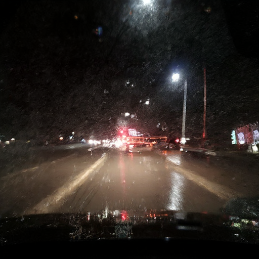
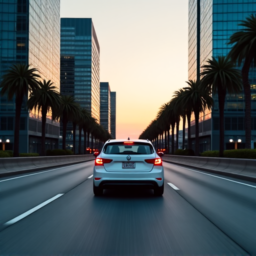

# 🚗 LoRA Fine-Tuning for Realistic Traffic Scenes with Flux

This repository contains code and examples for fine-tuning the **Flux diffusion model** using **LoRA** to generate **realistic and diverse traffic scenes**.

## ✨ Fine-Tuning Showcase

Below are examples comparing image generations from the **base model** and the **LoRA fine-tuned model**.

---

### 📌 Case 1: Heavy rain at night

**Prompt**:
*A front-facing dashcam view from an autonomous vehicle driving through heavy rain at night. The road surface is wet and reflective, with blurred reflections of streetlights and vehicle headlights. Raindrops cover the windshield, creating distortion and water trails. Visibility is low, and the sky is dark. A few distant vehicles are seen with bright taillights glowing through the downpour.*

**Base model output:**

**Fine-tuned model output:**

---

### 📌 Case 2: Urban Commute at Dusk

**Prompt**:
*Urban Commute: A white car navigates a multi-lane highway at dusk, with modern buildings and palm trees framing the scene.*

**Base model output:**

**Fine-tuned model output:**

---

### 📌 Case 3: Nighttime Glare on Rural Road

**Prompt**:
*A front-facing view from a self-driving vehicle driving on a two-lane rural road at night. The vehicle encounters intense glare from oncoming headlights, causing partial blinding and reduced visibility. The road edges are hard to distinguish. Trees and roadside reflectors barely visible in the background. The image mimics a real-world visibility hazard.*

**Base model output:**

**Fine-tuned model output:**

